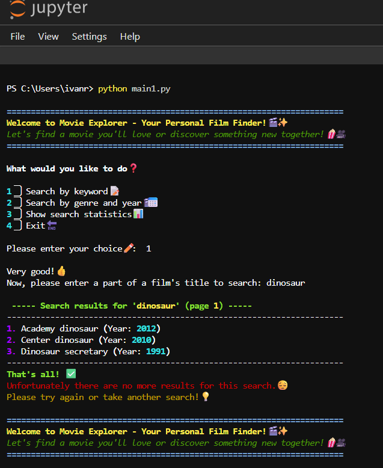
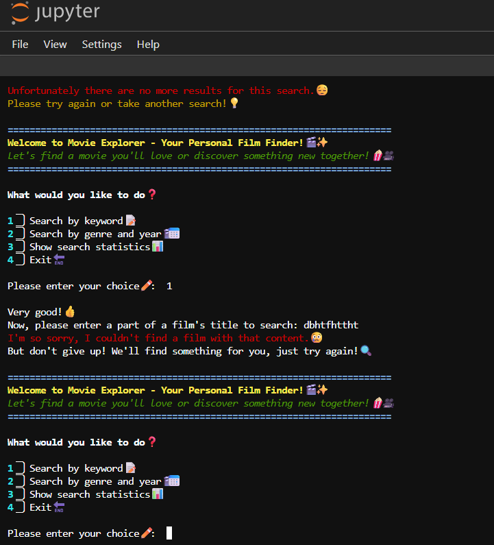
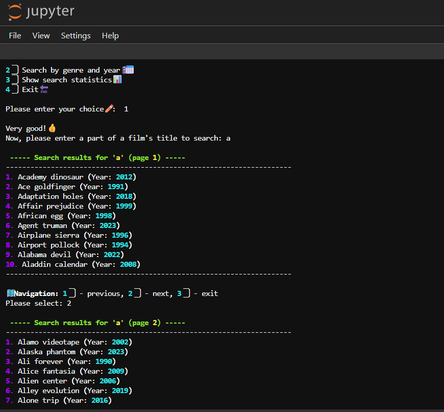
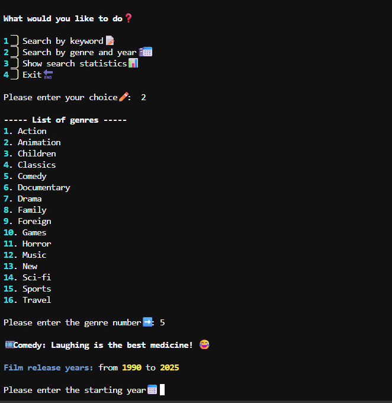
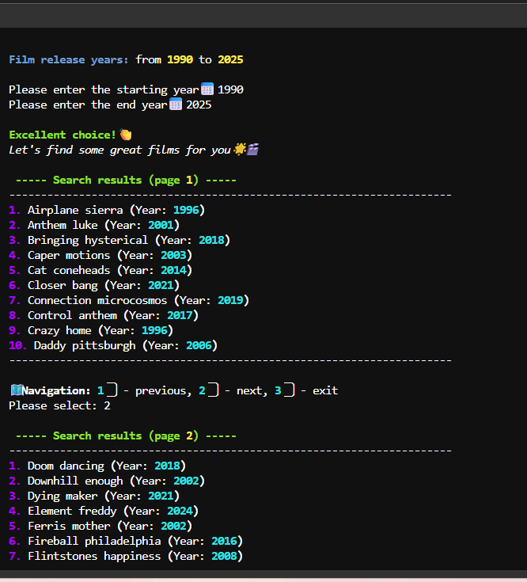
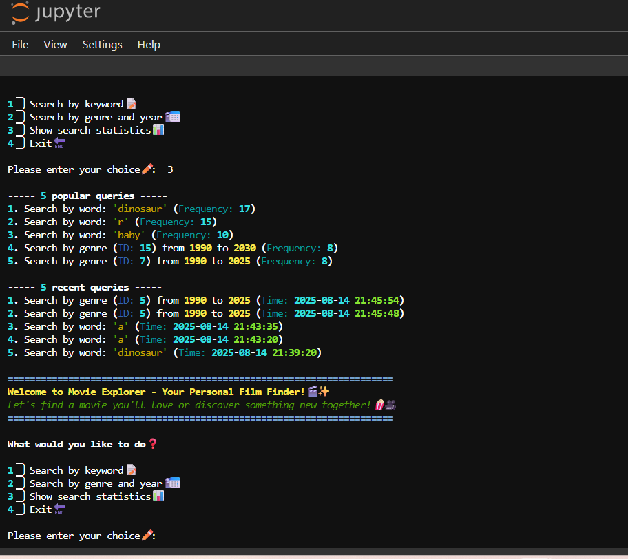
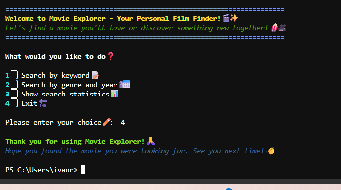

# 🎥 Python Movie Search Engine (MySQL & MongoDB)

## Project Goal
This project is an interactive Command-Line Interface (CLI) application developed in Python to provide efficient and structured search capabilities across the **Sakila (MySQL)** film database. The application's core goal is to deliver a seamless user experience while demonstrating full-stack data persistence by logging all search activity to a **MongoDB** NoSQL database.

## 🛠️ Technologies and Libraries

* **Primary Language:** Python
* **Relational Database:** MySQL (Sakila database)
* **NoSQL Database:** MongoDB (for query logging)
* **Database Connectors:** `pymysql`, `pymongo`
* **Code Quality:** Strict adherence to **PEP8** standards, modular design, and robust error handling.

## ✨ Core Features and Functionality

The application is structured to handle data retrieval, processing, and logging efficiently:

### 1. Interactive Movie Search (MySQL)
* **Keyword Search:** Allows searching films by title. Results are paginated (10 results per view).
* **Genre and Year Range Filter:** Guides the user with available genres and the min/max release year from the database before applying a detailed filter (e.g., *from 2005 to 2012*). Results are also paginated.

### 2. Query Logging and Analysis (MongoDB)
* **Real-time Logging:** Every user search request (including query parameters, result count, and timestamp) is logged to a dedicated collection in MongoDB.
* **Statistics:** Displays a list of the top 5 most frequent search queries or the 5 most recent unique queries.

### 3. Application Structure
The code is modularized to ensure high readability and maintainability:
* `main1.py`: Entry point, user menu, and command processing.
* `mysql_connector1.py`: Handles MySQL connection and search queries (keywords, genres, pagination).
* `log_writer1.py`: Handles connection to MongoDB and logging of new queries.
* `log_stats1.py`: Retrieves and processes popular/recent queries from MongoDB.
* `formatter1.py`: Utility functions for clean console output formatting.

---

## 🎨 User Experience and Readability

A key focus of this CLI application is an enhanced user experience. The console output utilizes **diverse color schemes and emojis** to improve readability, draw user attention to key information, and make the interaction more engaging and user-friendly.

---

## ⚙️ Setup and Running Locally

To run this application, you need access to a MySQL Sakila database and a running MongoDB instance.

1.  **Clone the repository:**
    ```bash
    git clone [YOUR REPO LINK]
    cd [YOUR REPO NAME]
    ```
2.  **Install dependencies:**
    ```bash
    pip install -r requirements.txt
    ```
3.  **Configure Database Connections:**
    * Ensure your `local_settings1.py` file is correctly configured with your MySQL (host, user, password) and MongoDB connection details. **Remember: `local_settings1.py` is excluded from the repository via `.gitignore` for security.**
4.  **Run the application:**
    ```bash
    python main1.py
    ```

---
## 🖼️ Project Demonstration

This section showcases the application's interactive console interface and core functionalities.

### 1. Main Menu and Keyword Search Example


### 2. Handling No Search Results


### 3. Paginated Keyword Search


### 4. Genre and Year Search - Input Guidance


### 5. Paginated Genre and Year Search Results


### 6. Search Statistics (Popular and Recent Queries)


### 7. Exiting the Application


---
## 🖼️ Project Demonstration

[Placeholder for Demonstration Screenshots]
